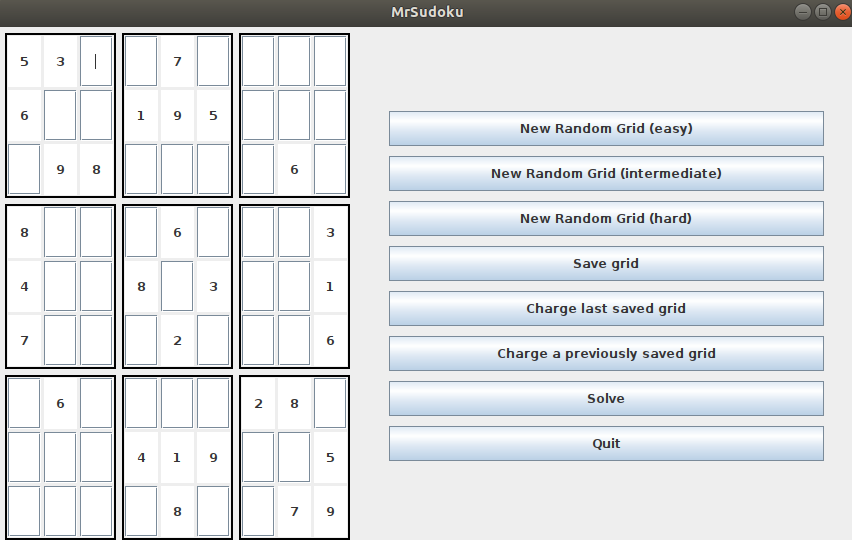
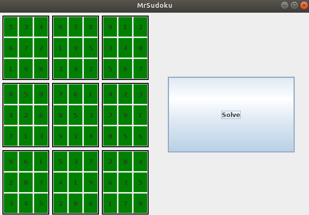

# Mini-projet MrSudoku

Réalisation d'un Sudoku avec solver et implémentation de fonctionnalités supplémentaires telles que :

* Sauvegarde d'une grille en cours et chargement de cette grille lors de la prochaine partie
* Génération de grilles aléatoires (cette génération est parfois imparfaite car certaines grilles peuvent s'avérer compliquées à résoudre car il est nécessaire pour certaines cases de supposer un chiffre parmi ceux possibles pour pouvoir aboutir à la solution). Ces grilles sont réparties en niveaux (Easy - Intermediate - Hard)
* Possibilité de jouer en utilisant une grille importée. Il faut alors ajouter la grille à la fin de `./lastgrid.txt`  et de choisir `Charge Last Saved Grid` dans le menu. Cet ajout peut se faire en éditant directement ce fichier (en respectant le format qui est celui retourné par `mrsudoku.grid/grid->str`).

